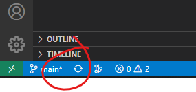
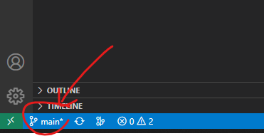
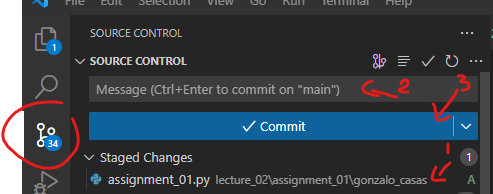
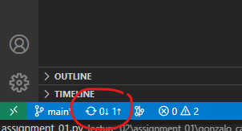

# Assignment 01

Project box to xy-plane:

* Create a box at a certain location with a certain orientation.
* Create a Projection (can be orthogonal, parallel or perspective)
* Convert the box to a mesh and project the it onto the xy-plane.
* Use artists to draw the result

## How to start

Use the following code as a starting point for your assignment:

```python
"""Assignment 01: Project box to xy-plane
"""
from compas.artists import Artist
from compas.datastructures import Mesh
from compas.geometry import Box
from compas.geometry import Frame
from compas.geometry import Plane
from compas.geometry import Projection

# Define a Frame, which is not in the origin and a bit tilted to the world frame
# frame =

# Create a Box with that frame
# box = ...

# Create a Projection (can be orthogonal, parallel or perspective)
# P = Projection.from_...

# Create a Mesh from the Box
mesh = Mesh.from_shape(box)

# Apply the Projection onto the mesh
# mesh_projected = ...

# Create artists
artist1 = Artist(box)
artist2 = Artist(mesh_projected)

# Draw and all to a list
artist1.draw()
artist2.draw_edges(color="#00ff00")

```

## Helpful links

* [Documentation of `Projection`](https://compas.dev/compas/latest/api/generated/compas.geometry.Projection.html?highlight=projection#compas.geometry.Projection)

## Expected result


## How to submit your assignment

1. Update/sync the repository of the course:

    

2. Create a branch called `a01-your-name` (replacing `your-name` with your actual name, all lowercase, use dashes instead of spaces)

    

3. Create a folder with your name and last name, eg. `david_bowie` (make sure it is inside the current assignment folder)
6. Create a Python file called `assignment_01.py` inside the folder created in the previous step, and paste the starting point code.
7. Solve the coding assignment and commit
    <details><summary><small>(How do I commit?)</small></summary>
    <p>

    

    </p>
    </details>

8. Once you're ready to submit, push the changes clicking the update/sync button again:

    

9. And create a pull request (<small>[What's a pull request?](https://docs.github.com/en/pull-requests/collaborating-with-pull-requests/proposing-changes-to-your-work-with-pull-requests/about-pull-requests)</small>)

    1. Open your browser and go to your fork
    2. Create the pull request clicking `Compare & pull request` and follow the instructions

    
