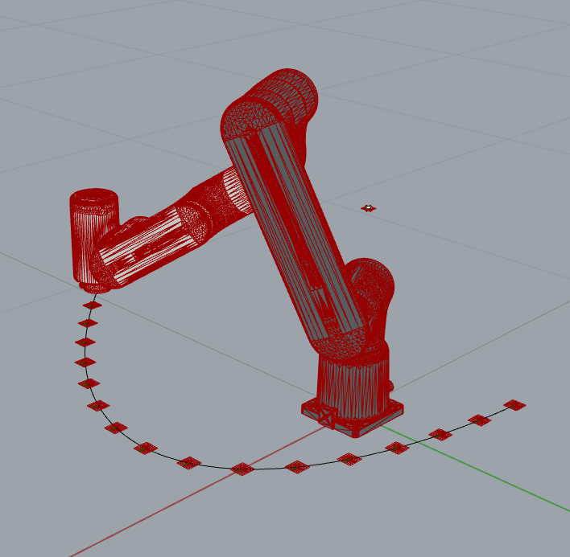

# Assignment 03

Using inverse kinematics and free-space planning.

* Copy the `assignment_03_template.ghx` into your personal assignment folder and rename to `assignment_03.ghx`.
* Start the MoveIt Noetic container for the GoFa robot on your laptop.
* Load the robot from ROS.
* Define a pickup plane.
* Define a list of target planes.
* Calculate the Inverse Kinematic solution for the pickup plane.
* Plan a free-space motion from pickup configuration to target plane.
* **INTERNALIZE ALL GEOMETRY!**
* Save the assignment (`assignment_03.ghx`, GHX is the non-binary save option of Grasshopper!) and commit.

## How to start

Use the `assignment_03_template.ghx` GH document as the starting point of this assignment.

## Expected result

## How to submit your assignment

1. **IMPORTANT: Make sure you switched branch back back to `main`!**
2. Update/sync the repository of the course:

    

3. Create a branch called `a03-your-name` (replacing `your-name` with your actual name, all lowercase, use dashes instead of spaces)

    

4. Create a folder with your name and last name, eg. `david_bowie` (make sure it is inside the current assignment folder)
5. Copy the `assignment_03_template.ghx` inside the folder created in the previous step and rename to `assignment_03.ghx`.
6. Solve the coding assignment and commit
    

<small>(How do I commit?)</small>

    

    

    

    

7. Once you're ready to submit, push the changes clicking the update/sync button again:

    

8. And create a pull request (<small>[What's a pull request?](https://docs.github.com/en/pull-requests/collaborating-with-pull-requests/proposing-changes-to-your-work-with-pull-requests/about-pull-requests)</small>)

    1. Open your browser and go to your fork
    2. Create the pull request clicking `Compare & pull request` and follow the instructions

    
